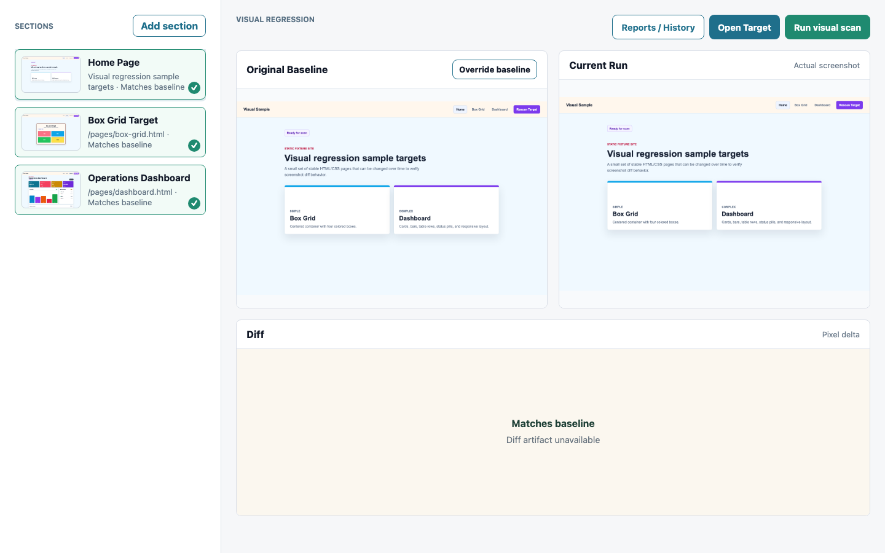

# Ratchet

Visual regression review dashboard for comparing approved baselines, current screenshots, and pixel diffs.



## Features

- Run Playwright-based visual scans from the dashboard.
- Review original baseline, current run, and diff artifacts side by side.
- Add sections and override baseline screenshots.
- Accept changed pages individually or approve all changed pages from a run.
- Block interactions during scans with a cancellable scanning overlay.

## Local Development

Install dependencies:

```sh
npm install
```

Run the Angular UI:

```sh
npm run start:angular
```

Run the Go backend:

```sh
npm run backend
```

Build the app:

```sh
npm run build
```

Run visual tests:

```sh
npm run test:visual
```
